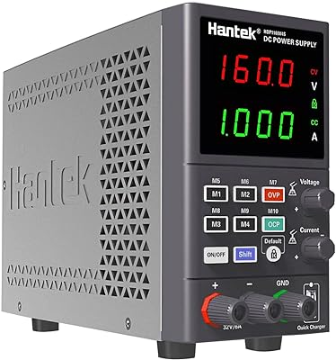

Setup:

* Using [USB-to-RS232](https://s.click.aliexpress.com/e/_DCOVD2J) adapter. Connected to [HDP1160V4S](https://s.click.aliexpress.com/e/_DCkHtB1) PSU.
* Intel NUC running Proxmox 7.4.

Connecting usb-to-rs232 port to nuc, shows the following 3 devices:

```
/dev/gpiochip0
/dev/serial
/dev/ttyUSB0
```

`lsusb` returns:

```
Bus 001 Device 122: ID 0403:6001 Future Technology Devices International, Ltd FT232 Serial (UART) IC
```

Look at https://github.com/clayton-r/Hantek-Power-Supply-Controller/blob/master/Utils.py for ideas.

It appears that whether the RS232 port is connected to the PSU or not the lsusb and /dev/ items are still present.

Found [this manual](http://www.hantek.com/uploadpic/hantek/files/20220402/HDP_SCPI_EN.pdf)

Attempting to send commands from the utils.py above or the manual does nothing. Whether the PSU connected or not, commands appear to be sending, but no response is received.

test code: (requires `pyserial` package)

```python
import serial

device = '/dev/ttyUSB0'

def send_command(command, baud):
    s = serial.Serial(port=device, baudrate=baud, timeout=1)
    s.write(command.encode())
    resp = s.read(1)
    s.close()
    return resp

def main():
    for baud in [2400, 4800, 9600, 19200, 38400, 57600, 115200]:
        response=send_command('SYSTem:GET:MODEl?\r', baud) # also tried *IDN? command
        print('Baudrate: %d, response: %s' % (baud, response))
if __name__ == '__main__':
    main()
```

Tested the output of RS232 cable with oscilloscope - TX is coming through.

## Breakthrough

after monitoring the serial communication between the Hantek app and the PSU, this code works to read the device model:

```python
import serial

# Hex data to send
hex_data = "ff ff 02 20"
byte_data = bytes.fromhex(hex_data)

# Serial port configuration
port = "/dev/ttyUSB0"
baudrate = 2400

# Initialize serial connection
with serial.Serial(port, baudrate, timeout=3) as ser:
    ser.write(byte_data)
    resp=ser.readline()
    print("resp:", resp)
```
responds with 'HDP1160V4S'


## Commands
(decoded so far)

|hex|meaning|
|---|-------|
|ff ff 02 20|get model|
|ff ff 02 09|get active voltage output in centivolts*. when output is off, will return '0'|
|ff ff 02 0a|get active current in milliamps|
|ff ff 02 12|get the voltage limit in centivolts*|
|ff ff 02 13|get the current limit in milliamps|
|ff ff 02 14|get on/off status|
|ff ff 03 06 00|turn off output|
|ff ff 03 06 01|turn on output|
|ff ff 04 07 bc 02|set output voltage in little-endian (7.00V here)|
|ff ff 04 08 3e 01|set output current in little-endian (0.318A here)|
|ff ff 04 17 3e 01|set OVP|
|ff ff 04 18 3e 01|set OCP|
|ff ff 03 1a 01|turn on OCP, 00 - off|
|ff ff 03 19 01|turn on OVP, 00 - off|


Centivolts are 100th of a volt: e.g. '1523' -> 15.23V, '11230' -> 112.3V

